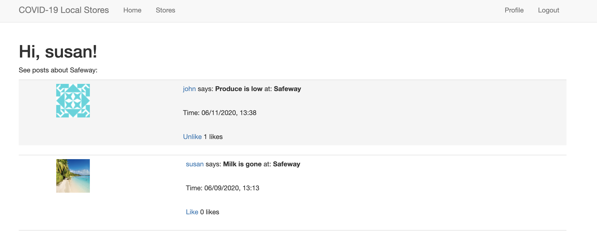
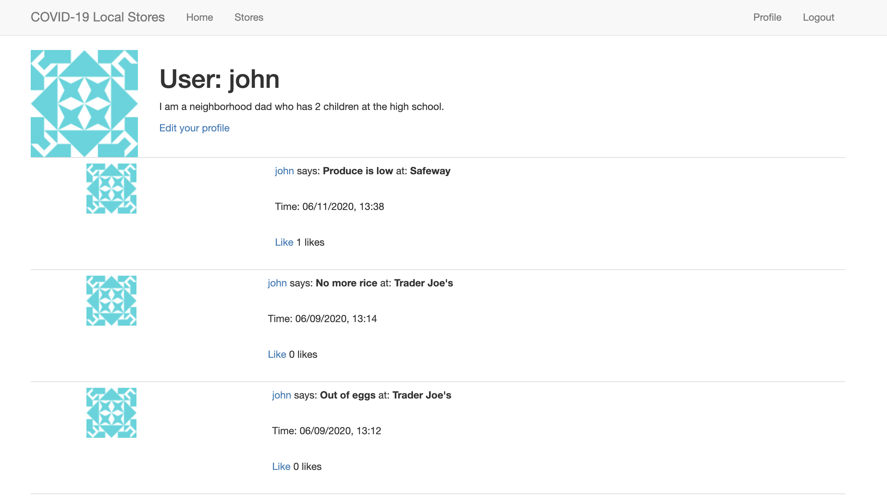
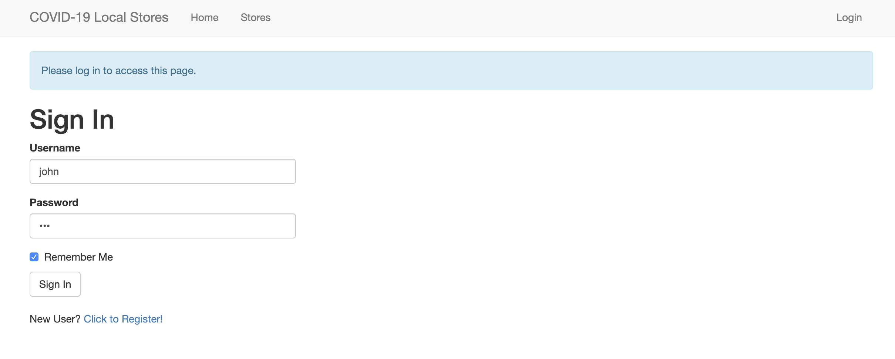

# covid19-stores

Users post about local stores about which products are in/out of stock at local groceries. Users can like posts, sort posts by grocery, and update their profile picture and "about me" description.

Home page:

Sort by store view:

Profile page:

Login page:

Note: learned much of the Flask used in this project from https://blog.miguelgrinberg.com/post/the-flask-mega-tutorial-part-i-hello-world
